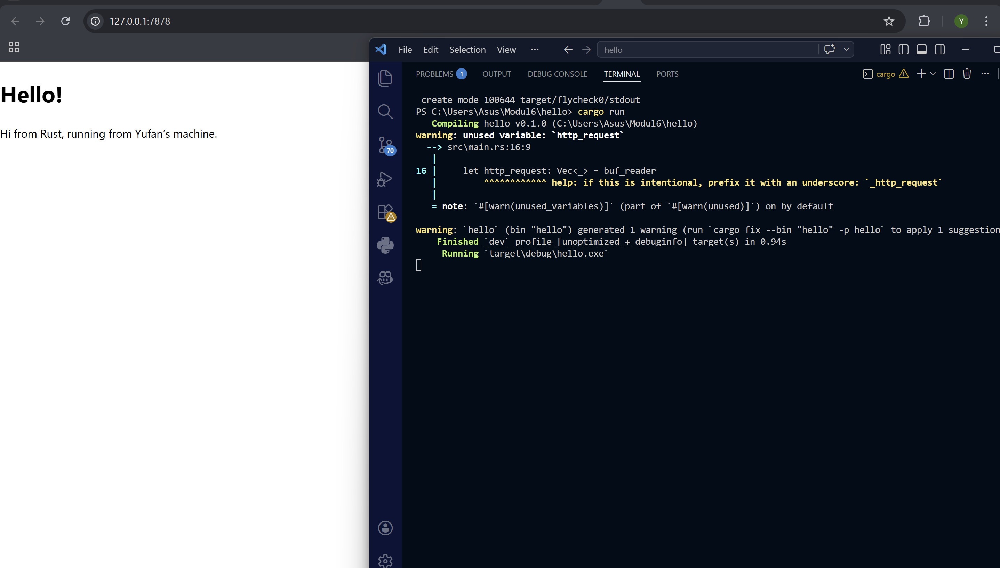
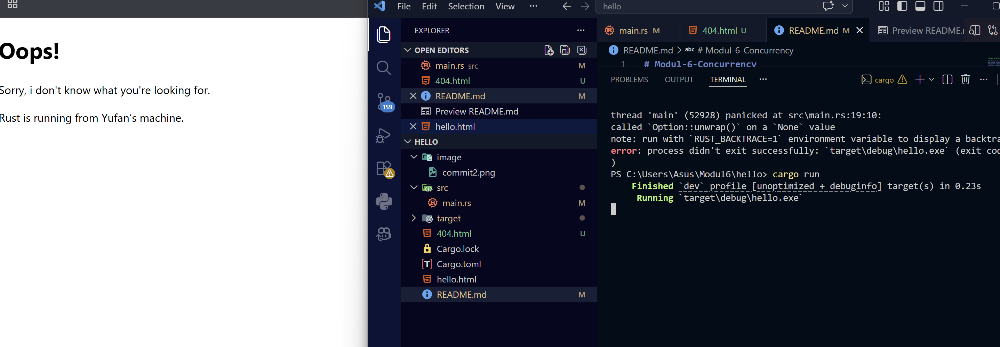

# Modul-6-Concurrency

**Commit 1 Reflection notes**

Pada milestone ini, saya mempelajari bagaimana membuat web server sederhana menggunakan Rust dengan memanfaatkan `TcpListener` untuk menerima koneksi dari client (browser). Program awal hanya menerima koneksi dan mencetak pesan “Connection established!”, yang menunjukkan bahwa server berhasil mendengarkan request dari browser pada alamat `127.0.0.1:7878`.

Selanjutnya, program dikembangkan dengan menambahkan fungsi `handle_connection` yang bertugas menangani setiap koneksi yang masuk. Pada fungsi ini digunakan `BufReader` untuk membaca data dari `TcpStream`, kemudian method `.lines()` digunakan untuk membaca request HTTP baris per baris. Data tersebut dikumpulkan ke dalam sebuah `Vec<String>` hingga menemukan baris kosong yang menandakan akhir dari header HTTP.

Dari hasil output, terlihat bahwa browser mengirimkan request dalam format HTTP, seperti:

- `GET / HTTP/1.1`
- `Host`, `User-Agent`, dan header lainnya

Hal ini memberikan pemahaman bahwa komunikasi antara browser dan server menggunakan protokol HTTP berbasis teks, dan server perlu memproses request tersebut untuk memberikan response yang sesuai.

Selain itu, saya juga memahami bahwa browser dapat mengirim beberapa request sekaligus (retry), sehingga pesan “Connection established!” bisa muncul lebih dari satu kali. Ini merupakan perilaku normal dari browser.

**Commit 2 Reflection notes**

Pada tahap ini, saya memodifikasi fungsi handle_connection agar server tidak hanya menerima request, tetapi juga mengirimkan response berupa halaman HTML ke browser. Saya mempelajari bahwa server harus mengirim response HTTP yang terdiri dari status line, header (seperti Content-Length), dan body (isi HTML). File hello.html dibaca menggunakan fs::read_to_string, lalu dikirim ke browser melalui TcpStream.

Dari percobaan ini, saya memahami bagaimana browser menampilkan halaman berdasarkan response dari server, serta pentingnya format HTTP yang benar agar response dapat diproses dengan baik. Sekarang server sudah mampu memberikan output nyata berupa halaman web sederhana, bukan hanya mencetak request di terminal.

**Commit 3 Reflection notes**

Pada tahap ini, saya mengembangkan server yang sebelumnya selalu memberikan halaman hello.html untuk semua request, menjadi lebih cerdas dengan memvalidasi request yang masuk. Sekarang, jika user mengakses path `/`, server akan menampilkan halaman utama, sedangkan jika mengakses path lain seperti `/bad`, server akan memberikan response 404 Not Found. Hal ini membuat perilaku server lebih realistis seperti web server pada umumnya.

Selain itu, dilakukan refactoring dengan memisahkan logika penentuan response (memilih status dan file HTML) dari proses pengiriman response ke client. Refactoring ini diperlukan agar kode lebih terstruktur, mudah dibaca, dan mudah dikembangkan, terutama jika nantinya ingin menambahkan lebih banyak routing atau fitur lain. Dengan perubahan ini, saya memahami pentingnya validasi request serta bagaimana membangun response yang sesuai berdasarkan input dari client.

**Commit 4 Reflection notes**

Pada tahap ini, ditunjukkan bahwa server masih menggunakan single thread, sehingga hanya dapat memproses satu request dalam satu waktu. Ketika ada request yang membutuhkan waktu lama, seperti endpoint `/sleep` yang menunda respons selama beberapa detik, maka request lain harus menunggu hingga proses tersebut selesai. Hal ini menyebabkan halaman lain yang seharusnya cepat diakses ikut mengalami keterlambatan.

Dari simulasi ini dapat dipahami bahwa penggunaan single thread menimbulkan bottleneck pada server ketika menangani banyak request secara bersamaan. Kondisi ini tidak ideal untuk aplikasi nyata karena dapat menurunkan performa dan pengalaman pengguna. Oleh karena itu, diperlukan pendekatan seperti multithreading agar server dapat menangani beberapa request secara paralel dan lebih responsif.

**Commit 5 Reflection notes**

Pada tahap ini, server ditingkatkan dari model sebelumnya menjadi multithreaded menggunakan ThreadPool. Berbeda dengan pendekatan sebelumnya yang membuat thread baru untuk setiap request, ThreadPool membuat sejumlah thread tetap (worker) di awal dan mendistribusikan pekerjaan ke thread tersebut melalui mekanisme antrian (queue). Hal ini membuat penggunaan resource menjadi lebih efisien dan terkontrol.

Cara kerja ThreadPool adalah ketika ada request masuk, tugas tersebut dikemas sebagai sebuah job (closure) dan dikirim melalui `mpsc::channel`. Setiap worker yang berjalan dalam thread terpisah akan mengambil job dari queue menggunakan `receiver` yang dibagikan dengan `Arc<Mutex<_>>`, lalu mengeksekusinya. Penggunaan `Arc` memungkinkan banyak worker berbagi akses ke receiver yang sama, sementara `Mutex` memastikan hanya satu worker yang mengambil job pada satu waktu sehingga menghindari race condition.

Dengan pendekatan ini, server dapat menangani beberapa request secara paralel tanpa harus membuat thread baru terus-menerus. Hal ini meningkatkan performa dan stabilitas dibandingkan model sebelumnya, terutama ketika menangani banyak request atau request yang lambat seperti `/sleep`. Saya juga memahami bahwa desain ThreadPool membuat sistem lebih scalable dan lebih mendekati implementasi server di dunia nyata.

**Bonus Reflection notes**

Pada tahap ini, saya memodifikasi fungsi pembuatan `ThreadPool` dengan menambahkan fungsi `build` sebagai alternatif dari `new`. Perbedaan utama antara keduanya adalah pada cara menangani error. Fungsi new menggunakan `assert!` yang akan langsung menghentikan program (panic) jika ukuran thread bernilai nol, sedangkan fungsi `build` menggunakan tipe `Result` sehingga error dapat ditangani dengan lebih aman dan fleksibel.

Dengan menggunakan `Result`, program tidak langsung crash, tetapi memberikan kesempatan kepada developer untuk menentukan bagaimana menangani error tersebut, misalnya dengan menampilkan pesan atau fallback ke nilai default. Pendekatan ini lebih sesuai untuk pengembangan aplikasi yang lebih kompleks dan mendekati praktik di dunia nyata.

Dari perubahan ini, saya memahami pentingnya error handling yang baik dalam Rust, serta perbedaan antara pendekatan yang bersifat cepat (panic) dan pendekatan yang lebih robust (Result-based). Penggunaan fungsi `build` membuat kode menjadi lebih aman, fleksibel, dan siap untuk dikembangkan lebih lanjut.